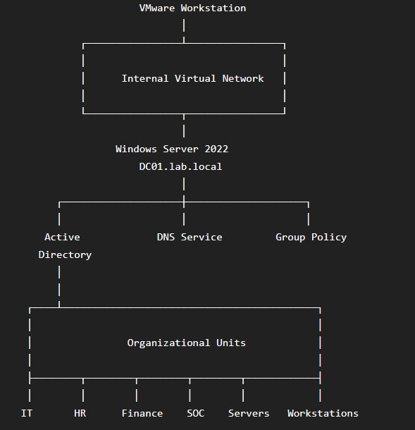
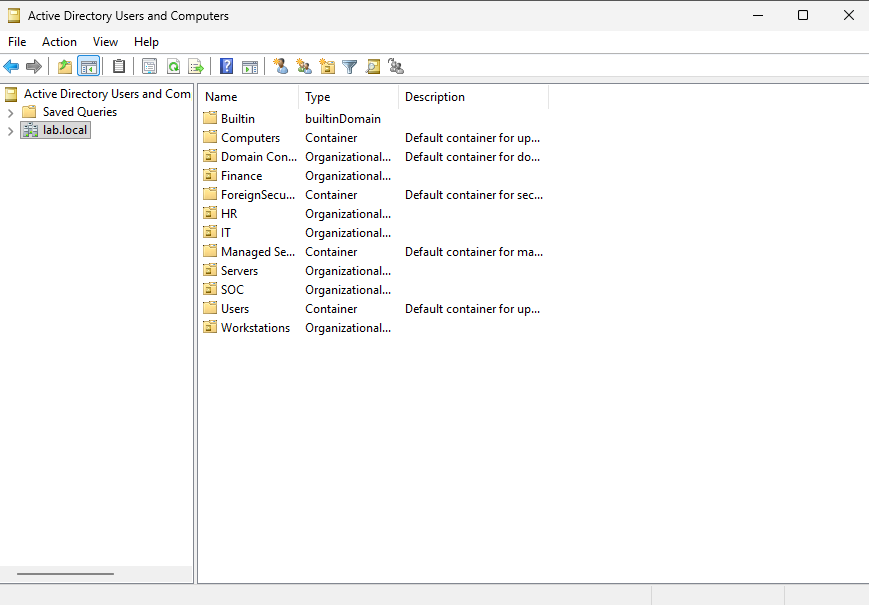
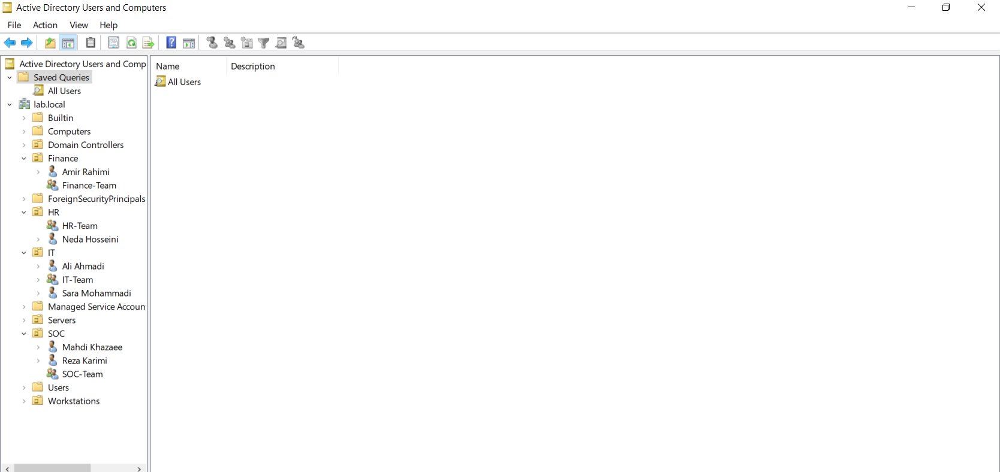
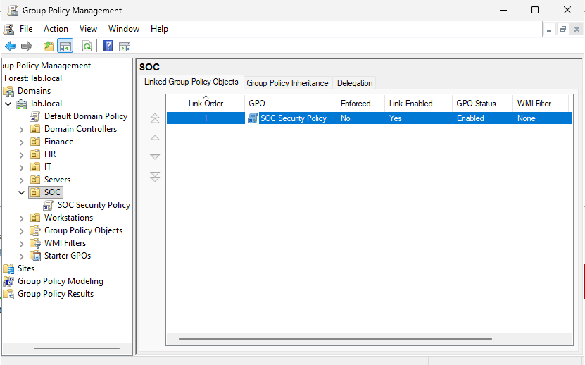

 # Windows Server 2022 & Active Directory Enterprise Lab

<p align="center">


</p>

---

## Business Scenario

A small organization requires a centralized identity management solution to securely manage users, departments, authentication, and access permissions.

To simulate a real enterprise environment, a Windows Server 2022 infrastructure was deployed using Active Directory Domain Services (AD DS). This lab serves as the foundation for future security monitoring, Windows Event Logs, Sysmon, Splunk, and Incident Response projects.

---

# Project Overview

This repository documents the deployment of an enterprise-style Windows Server 2022 and Active Directory environment.

The primary goal is to build a realistic corporate infrastructure that can later be used for security monitoring and SOC-related activities rather than simply installing Windows Server.

---

# Objectives

- Deploy Windows Server 2022
- Configure Active Directory Domain Services (AD DS)
- Promote a Domain Controller
- Configure Active Directory Integrated DNS
- Design Organizational Units
- Create enterprise users
- Create Security Groups
- Configure basic Group Policy
- Prepare infrastructure for future SOC labs

---

# Lab Environment

| Component | Configuration |
|------------|---------------|
| Hypervisor | VMware Workstation Pro |
| Operating System | Windows Server 2022 |
| Hostname | DC01 |
| Domain | lab.local |
| Active Directory | Enabled |
| DNS | Active Directory Integrated |

---

# Lab Architecture

> Enterprise Lab Topology



---

# Active Directory Structure

```text
lab.local
│
├── IT
│   ├── ali
│   ├── sara
│   └── IT-Team
│
├── SOC
│   ├── mahdi
│   ├── reza
│   └── SOC-Team
│
├── HR
│   ├── neda
│   └── HR-Team
│
├── Finance
│   ├── amir
│   └── Finance-Team
│
├── Servers
│
└── Workstations
```
---

# Project Scope

The following components have been implemented in this lab:

- Windows Server Deployment
- Active Directory Domain Services
- Domain Controller Promotion
- DNS Configuration
- Organizational Unit Design
- Enterprise User Management
- Security Group Administration
- Group Policy Foundation

---

# Security Relevance

Active Directory is one of the primary identity management systems used in enterprise environments.

Understanding its architecture is essential for SOC Analysts because authentication events, account management activities, privilege changes, and many Windows security events originate from Active Directory.

This infrastructure provides the required foundation for future log analysis and threat detection.

---

# Technical Skills Demonstrated

- Windows Server Administration
- Active Directory Administration
- Domain Controller Deployment
- DNS Configuration
- Identity Management
- Organizational Unit Design
- User Administration
- Security Group Management
- Group Policy Management

---

# Project Gallery

## Domain Controller

---

## Organizational Unit Structure



---

## Users & Security Groups



---

## Group Policy



---

# Enterprise Design Highlights

- Centralized Authentication
- Domain-based Identity Management
- Department-based Organizational Units
- Security Group Administration
- Group Policy Hierarchy
- Enterprise-ready Infrastructure
- Scalable Design for Future Security Labs

---

# Lessons Learned

During this project I gained practical experience with:
[7/30/2026 5:13 PM] Mahdi: - Active Directory deployment
- Domain Controller configuration
- Enterprise OU design
- User lifecycle management
- Security Group implementation
- Group Policy fundamentals
- Enterprise identity infrastructure

---

# Future Work

The infrastructure created in this repository will be extended with:

- Windows Security Event Logs
- Windows Event Forwarding (WEF)
- Sysmon
- Splunk Enterprise
- Log Analysis
- Threat Detection
- MITRE ATT&CK Mapping
- Incident Response
- Endpoint Monitoring

---

# Repository Status

| Module | Status |
|----------|--------|
| Windows Server | ✅ |
| Active Directory | ✅ |
| DNS | ✅ |
| Organizational Units | ✅ |
| Users | ✅ |
| Security Groups | ✅ |
| Group Policy | ✅ |
| Windows Event Logs | ⏳ |
| Sysmon | ⏳ |
| Splunk Enterprise | ⏳ |

---

# Author

Mohammad Khazaee

Cybersecurity Portfolio